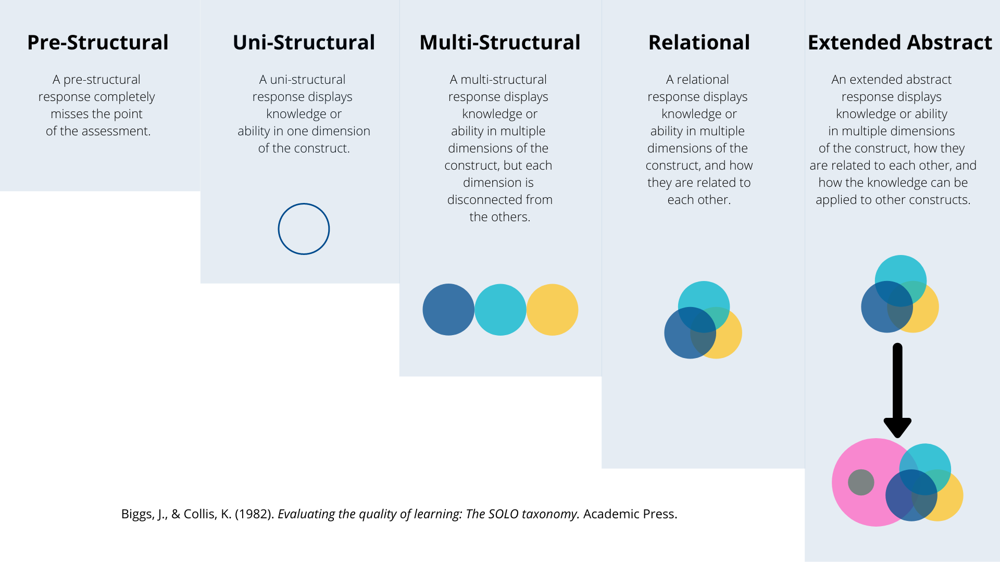

An important reality of higher education is that I need to provide a single number between 0 and 100 to the university that encapsulates the effort, successes, failures, struggles, discoveries and messiness of your work during this course. If I am going to be fair about it, I need to consider where you are starting relative to where you end up, I need to understand your individual context, and I need to be able to determine that number by researching your work.

***Assessment is research.*** You need to show me evidence that you have met the outcomes of the course in alignment with the parameters of the assignment, and you need to do so in a way that shows you can think clearly, write persuasively, and extend your learning beyond the boundaries of the course.

This is a very tall order.

One thing that you should consider is that my assessment of your work is not an assessment of you as a person. It is an assessment of what you have shown me in relation to the outcomes of the course. One way that you can ensure that you are providing reflections and creating work that is of high academic quality is to use the SOLO Taxonomy.

### SOLO Taxonomy

SOLO stands for *Structure of the Observed Learning Outcome* and is a gauge to help you (and me) ensure that you are writing at an appropriate level.

#### Pre-Structural  {-}
A pre-structural response completely ***misses the point*** of the assessment.

#### Uni-Structural  {-}
A uni-strucutral response displays knowledge or ability in ***one dimension of the construct***.

#### Multi-Structural  {-}
A multi-structural response displays knowledge or ability in ***multiple dimensions of the construct***, but each dimension is ***disconnected*** from the others.

#### Relational  {-}
A relational response displays knowledge or ability in ***multiple dimensions of the construct, and how they are related to each other***.

#### Extended Abstract  {-}
An extended abstract response displays knowledge or ability in ***multiple dimensions of the construct, how thy are related to each other, and how that construct can be applied to help us understand different constructs***.

If you are providing responses at a `pre- or uni-structural` level in a university course, you are going to have a bad time. `Multi-structural` responses will lead to grades in the 'C' range. At minimum, your responses should be `unambiguously relational` for a grade in the 'B' range and `extended abstract` for a grade in the 'A' range.

The UVic Undergraduate Grading Scale, available on the syllabus for this course, describes 'A' work as

>An A+, A, or A- is earned by work which is technically superior, shows mastery of the subject matter, and in the case of an A+ offers original insight and/or goes beyond course expectations. Normally achieved by a minority of students.

For a 'B', here is what you need to do:

> A B+, B, or B- is earned by work that indicates a good comprehension of the course material, a good command of the skills needed to work with the course material, and the student's full engagement with the course requirements and activities. A B+ represents a more complex understanding and/or application of the course material. Normally achieved by the largest number of students.

I am happy to have a conversation with you if you feel your work has been unfairly assessed and you can provide a justifiable rationale based on the product of your work in relation to the requirements of the assignment and the standards outlined above and in the University Calendar.
