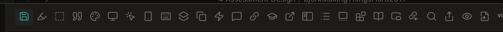
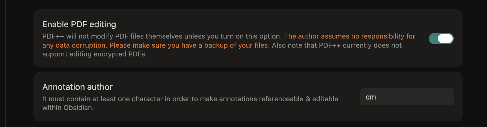
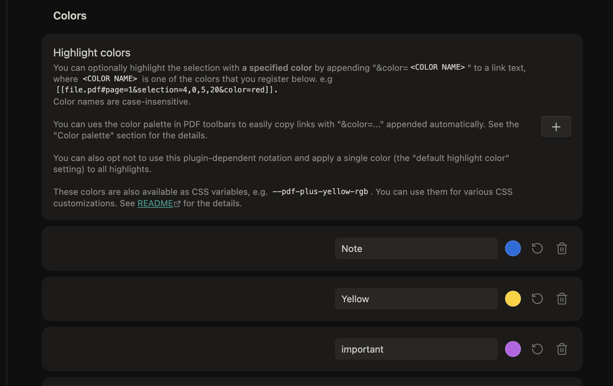
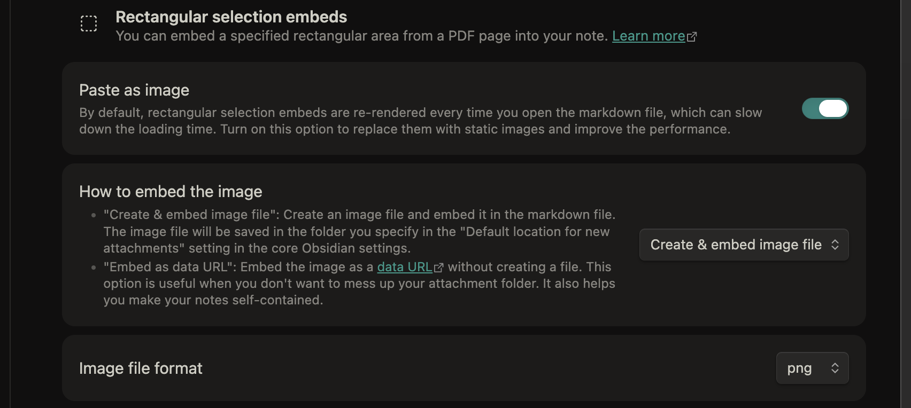
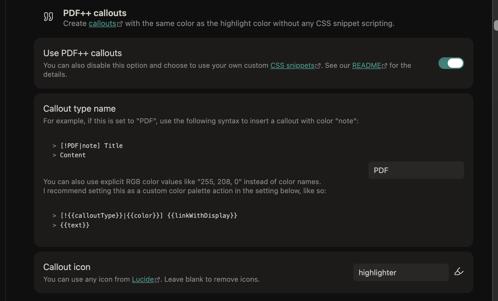
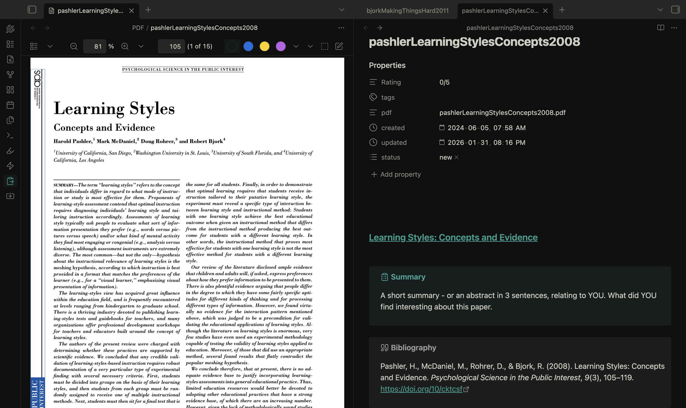
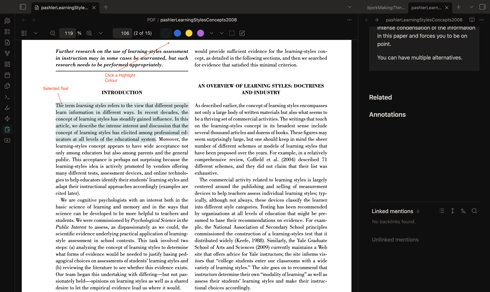

::: {.callout}
Photo credit: Colin Madland &copy; 2026
:::

A couple weeks ago, I came across a fellow PhD student, Amy, sharing her work on YouTube and WordPress, specifically, [her workflow between Zotero and Obsidian](https://girlinbluemusic.com/how-to-connect-zotero-and-obsidian-for-the-ultimate-phd-workflow). It's a great post, blog, and channel!

I have a similar workflow, and I think what I have learned might revise a part of her workflow to make it more accesssible for folks new to Obsidian. Her description of [setting up the Zotero Integration plugin](https://obsidian.md/plugins?id=obsidian-zotero-desktop-connector) is good, but after that, it gets a bit technical. [I suggest a simpler workflow using the PDF++ plugin.](https://obsidian.md/plugins?id=pdf-plus) You won't need to use the 'Highlightr' plugin, though you might want to use Amy's hex codes. You do need to complete the Obsidian Zotero Integration setup and you need to use the "Templater" plugin, though with much less setup.

## Source-note template setup

Amy's template requires a lot of code using the nunjucks language, which is pretty hard to parse for new users. You'll notice mine below has only two short lines of nunjucks and the rest is customisable markdown. I don't import tags from the PDF as I find they are often not what I want, so I leave that field as a manual entry field.

Copy the text below and paste it into your template. Make sure the Zotero Integration plugin is looking in the right folder for that file.


```
---
Rating: 0/5
tags:
pdf: "{{citekey}}.pdf"
created: 2024-06-05T07:58
updated: 2026-01-23T14:52
status:
  - new
---


#### [{{title}}]({{citekey}}.pdf)


> [!tldr] Summary
> A short summary - or an abstract in 3 sentences, relating to YOU. What did YOU find interesting about this paper. 

> [!cite] Bibliography
>{{bibliography}}


> [!quote] Quotable
> Imagine you would quote this paper in your publication. How would you do it? It is probably just one sentence followed by the reference. It is the most intense condensation of the information in this paper and forces you to be on point. 
> 
> You can have multiple alternatives. 


#### Related

#### Annotations


```

## Set up PDF++

Install and activate PDF++ like any other Community Plugin. The settings are _extensive_, but there are only a few that are critical. There is a toolbar across the top of the settings page that you can use to navigate the settings.



### Enable PDF editing

The first setting i recommend is to enable pdf editing, so that you can use Obsidian to markup your pdfs instead of Zotero.



### Set colour settings

If you want to use Amy's colour codes, this is where you can add them.



### Image embeds

I often use the rectangular selection tool to annotate plots and figures from pdfs. These settings make it super easy.



### PDF++ Callouts

This setting is important and automates the processs of highlighting annotations from the pdf.



### PDF files

One thing that I have done, and I can't remember if this is a requirement for PDF++ or not, is create a folder inside my vault called 'PDF' where I copy all the pdf files after I import from Zotero. I locate the file by right-clicking the reference in Zotero that has the pdf attached, and select 'Show in Finder'. Then I can drag the file (which has been renamed to the citeky via the 'attanger' plugin in Zotero).

## The Workflow

From Obsidian I hit my keyboard shortcut  to bring up the Zotero search bar (I'm using Zotero 8) 


I have my Zotero Integration plugin set to add new files to a folder called `00 ToDo` so I know where to find them. I also have the plugin open the file once it is imported.

Once the file is imported, I copy the pdf from Zotero into the PDF folder in my vault.

Then, if all has worked, when I click on the title in the imported file, the PDF will open in a viewer to the side.

::: {.callout-note}
If you haven't copied the PDF file to your vault, Obsidian will treat the link as a regular internal link and will create a `citekey.pdf.md` file instead of opening the pdf.
:::



Notice the PDF++ toolbar at the top. 

- Start with your cursor below the 'Annotations' heading at the bottom of the page (unless you've moved it...).
- select some text in the pdf
- click one of the coloured buttons in the PDF++ toolbar



- the PDF will be annotated
- the obsidian file will be populated with the text of the annotation in a callout


- the title of the callout will link to the annotation in the PDF
- click the callout title to go to the annotation in the PDF
- hover over the callout title to see a preview
- you can edit the text in the callout to include tags that will show up in your graph and be searchable

## Summary

This workflow with PDF++ skips most of the complexity of Amy's template file and also means you never have to re-import from Zotero because everything after the import happens inside Obsidian.

If you have questions, use the link on the right to create an issue.
